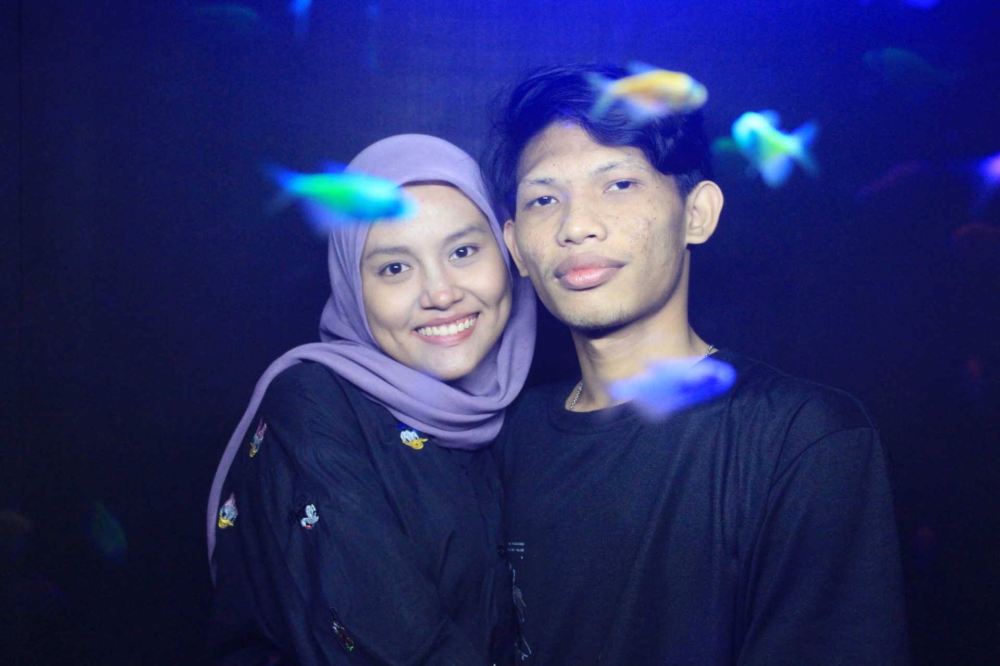
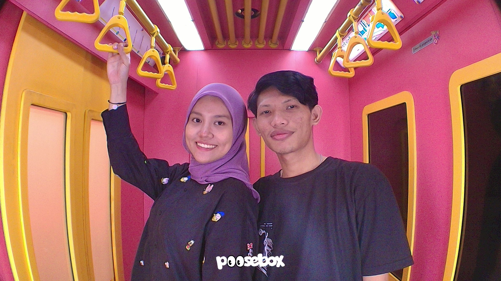

# 🎉 Panduan Setup Website Ulang Tahun di Vercel

Selamat! Anda sudah punya website ucapan ulang tahun yang indah dan romantis. Berikut cara setup dan deploy-nya:

## 📋 Yang Anda Perlukan

1. **GitHub Account** (gratis di github.com)
2. **Vercel Account** (gratis di vercel.com)
3. **Git** (untuk push file - download di git-scm.com)

---

## 🚀 Langkah-Langkah Deploy

### Step 1: Setup Repository di GitHub

1. Buat repository baru di GitHub dengan nama `birthday-love` (atau nama lain sesuai keinginan)
2. Clone repository ke komputer:
   ```bash
   git clone https://github.com/username-anda/birthday-love.git
   cd birthday-love
   ```

### Step 2: Tambahkan File-File

Copy ketiga file ini ke folder project:
- `birthday-love.html`
- `package.json`
- `vercel.json`

### Step 3: Push ke GitHub

```bash
git add .
git commit -m "Add birthday website"
git push origin main
```

### Step 4: Deploy ke Vercel

**Opsi A: Via Website Vercel (Paling Mudah)**
1. Buka https://vercel.com dan login
2. Klik "Add New..." → "Project"
3. Pilih repository GitHub Anda
4. Klik "Deploy"
5. Selesai! Website langsung live 🎉

**Opsi B: Via Vercel CLI**
```bash
npm i -g vercel
vercel
```

---

## 🎨 Customization

### Edit Nama & Pesan
Buka `birthday-love.html` dan cari bagian ini:

```html
<h1>Selamat Ulang Tahun!</h1>
<p class="subtitle">Hari spesial untuk orang yang paling spesial</p>
```

Ganti dengan nama dan pesan Anda sendiri.

### Edit Pesan di Card
Cari bagian "Message Cards" dan edit text di dalamnya:

```html
<h3 class="card-title">Terima Kasih</h3>
<p class="card-text">Terima kasih telah menjadi bagian indah dalam hidupku...</p>
```

### Ubah Warna
Cari bagian `background: linear-gradient(135deg, #ff69b4, #ff1493, #ff69b4);`
Ganti hex color dengan warna favorit Anda:
- `#ff69b4` = Pink light
- `#ff1493` = Deep pink
- Cari color picker online untuk menemukan warna lain

### Tambah Foto Pacar
Sebelum section "Momen Spesial Kita", tambahkan:

```html
<section class="gallery-section">
    <h2 class="gallery-title">Foto-Foto Kita ❤️</h2>
    <div class="gallery">
        
        
    </div>
</section>
```

Upload foto ke GitHub di folder yang sama dengan HTML.

---

## 🔗 URL Website Anda

Setelah deploy, Anda akan dapat URL seperti:
```
https://birthday-love-[random].vercel.app
```

Atau setup custom domain di Vercel settings.

---

## 🎯 Testing Sebelum Deploy

Buka file `birthday-love.html` langsung di browser untuk test:
1. Klik kanan file → "Open with Browser"
2. Lihat hasilnya
3. Test button "Buat Hari Ini Istimewa"

---

## 💡 Pro Tips

✨ **Bonus Features** (Opsional)
- Tambah musik background (edit `<audio>` tag)
- Custom domain gratis dari Vercel
- Buat countdown timer ulang tahun
- Share link ke social media

### Tambah Musik (Opsional)
Cari lagu MP3 gratis atau upload lagu Anda, lalu tambahkan sebelum closing `</body>`:

```html
<audio autoplay loop style="display: none;">
    <source src="lagu-romantic.mp3" type="audio/mpeg">
</audio>
```

---

## ❌ Troubleshooting

**Website tidak muncul setelah deploy?**
- Tunggu 1-2 menit untuk build selesai
- Refresh halaman dengan Ctrl+F5
- Cek tab "Deployments" di Vercel

**Foto/file tidak muncul?**
- Pastikan file di-push ke GitHub
- Gunakan path relatif: `./foto.jpg`
- Cek file sudah ada di repository

**Warna tidak berubah?**
- Clear browser cache: Ctrl+Shift+Delete
- Refresh dengan Ctrl+F5

---

## 📱 Share Website

Kirim link ini ke pacar:
```
https://birthday-love-[nama-anda].vercel.app
```

Atau buat QR code dari link tersebut!

---

## 🎁 Final Checklist

- [ ] Repository GitHub dibuat
- [ ] File di-push ke GitHub
- [ ] Deploy ke Vercel selesai
- [ ] Test di browser
- [ ] Customize text & warna
- [ ] Share link ke pacar ❤️

---

**Selamat! Website Anda sudah siap membuat hari spesial menjadi lebih berkesan! 🎉💕**

Jika ada pertanyaan, bisa tanya ke Vercel docs atau GitHub docs.

Enjoy! 🎊✨